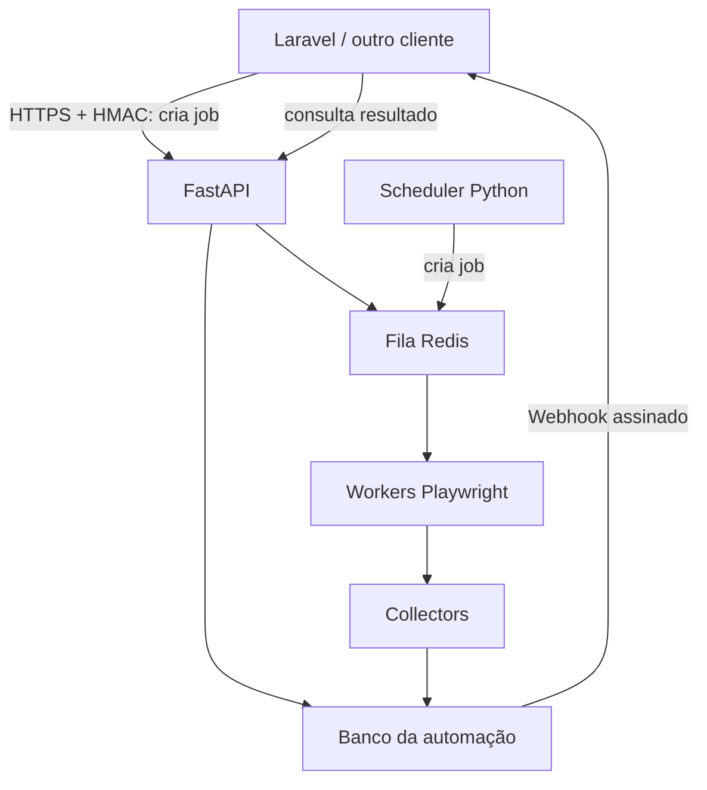
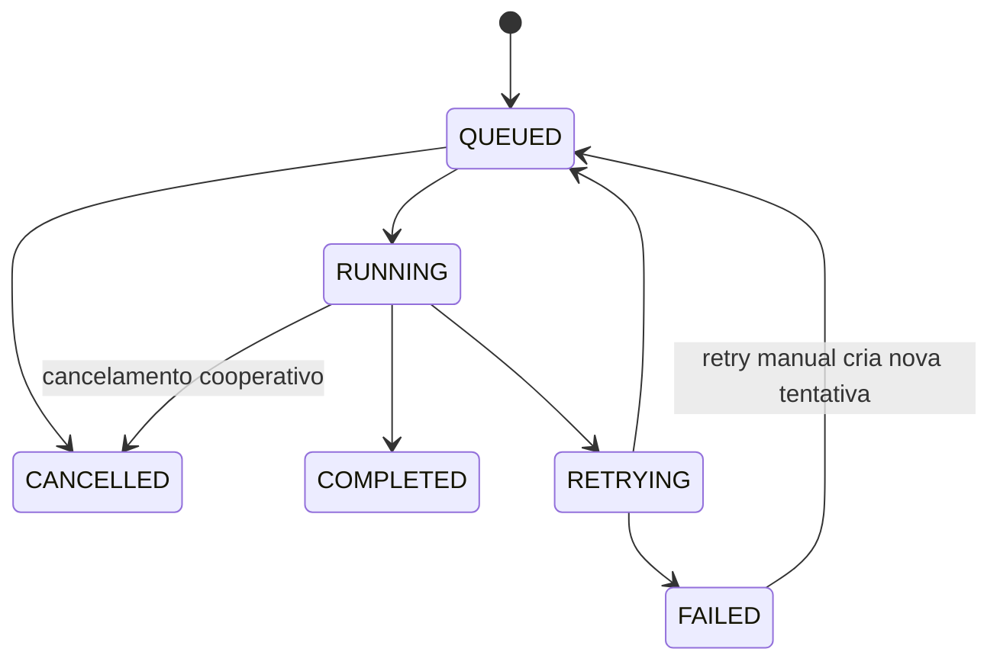
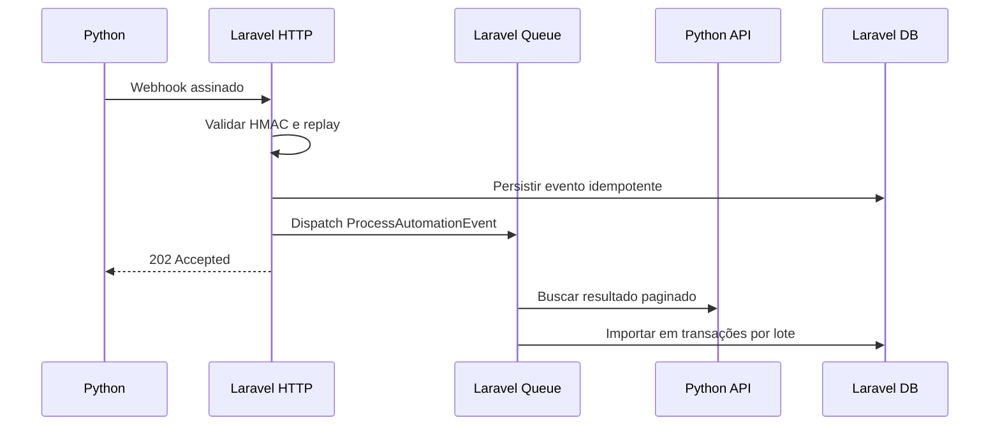

# Especificação de Arquitetura e Integração

## Serviço de Automação Python ↔ Aplicações Laravel

**Versão:** 1.0  
**Status:** Especificação inicial para implementação  
**Objetivo:** estabelecer um contrato compartilhado entre o serviço Python de automação e as aplicações consumidoras, inicialmente a aplicação Laravel.

---

## 1. Objetivo da arquitetura

O sistema Python deve funcionar como um **serviço independente de coleta e automação**, capaz de atender a aplicação Laravel atual e outras aplicações futuras.

A divisão de responsabilidade será:

- **Python:** acessar sistemas externos, executar automações com Playwright, coletar, validar e normalizar dados, controlar execuções e disponibilizar resultados.
- **Laravel:** solicitar coletas, receber notificações, importar os resultados e aplicar regras de negócio do ERP.

Regra central:

> O Python é dono da coleta e do estado operacional da automação. O Laravel é dono dos dados finais e das regras de negócio.

O Python não deve conhecer conceitos específicos como `Viagem`, `OrdemDeServico`, `Frete` ou regras particulares de uma empresa. Ele deve devolver dados normalizados. O Laravel decide como transformar esses dados em entidades do domínio.

---

## 2. Visão geral



Componentes previstos:

### Serviço Python

- FastAPI;
- banco próprio da automação;
- Redis;
- workers de execução;
- scheduler;
- Playwright;
- collectors independentes;
- entrega de webhooks com retry;
- logs estruturados e health checks.

### Aplicação Laravel

- cliente HTTP da Automation API;
- armazenamento local das solicitações e eventos recebidos;
- endpoint para webhooks;
- validação HMAC e proteção contra replay;
- processamento assíncrono por filas;
- importadores próprios por tipo de resultado;
- painel Filament de acompanhamento.

---

## 3. Princípios obrigatórios

1. Playwright nunca deve executar dentro de uma requisição HTTP.
2. Toda execução deve ser representada por um `job` persistido.
3. Toda execução, manual ou agendada, deve entrar pela mesma fila.
4. Python e Laravel devem usar bancos separados.
5. Nenhuma aplicação deve acessar diretamente as tabelas da outra.
6. Toda comunicação deve ocorrer por HTTPS e contrato versionado.
7. Webhook serve como notificação; o resultado continua disponível no Python.
8. Eventos e solicitações devem ser idempotentes.
9. O endpoint de webhook do Laravel deve responder rapidamente e processar em fila.
10. Credenciais dos sistemas externos pertencem ao serviço Python e nunca devem aparecer nos resultados.
11. Dados e logs sensíveis devem ser mascarados.
12. Alterações incompatíveis exigem nova versão da API.

---

## 4. Escopo da versão 1

A primeira versão deve oferecer:

- cadastro de clientes consumidores;
- criação de jobs;
- consulta do job;
- consulta paginada do resultado;
- cancelamento de job ainda não iniciado;
- retry manual de job com falha;
- pausa e retomada global de novas execuções;
- webhook de conclusão ou falha;
- autenticação HMAC nos dois sentidos;
- idempotência;
- retry automático de execução e entrega;
- health, readiness e status operacional;
- limites de concorrência por collector;
- painel básico no Filament.

Ficam fora da primeira entrega:

- Kubernetes;
- Kafka;
- execução distribuída em várias regiões;
- cancelamento forçado de Chromium em andamento;
- edição de credenciais externas pelo Laravel;
- regras de negócio do ERP dentro do Python.

---

## 5. Estrutura sugerida do projeto Python

```text
automation-service/
├── app/
│   ├── api/v1/
│   │   ├── jobs.py
│   │   ├── system.py
│   │   ├── collectors.py
│   │   └── health.py
│   ├── collectors/
│   │   ├── base.py
│   │   ├── sascar_positions/
│   │   │   ├── collector.py
│   │   │   ├── browser.py
│   │   │   ├── parser.py
│   │   │   └── schemas.py
│   │   └── outro_sistema/
│   ├── workers/
│   │   ├── tasks.py
│   │   └── runner.py
│   ├── services/
│   │   ├── job_service.py
│   │   ├── result_service.py
│   │   ├── webhook_service.py
│   │   └── idempotency_service.py
│   ├── models/
│   ├── schemas/
│   ├── repositories/
│   └── core/
│       ├── config.py
│       ├── security.py
│       ├── logging.py
│       └── exceptions.py
├── migrations/
├── tests/
├── docker/
├── pyproject.toml
└── .env.example
```

Cada collector deve receber parâmetros validados e retornar um resultado normalizado. Ele não deve realizar chamadas ao Laravel.

Interface conceitual:

```python
class Collector:
    name: str
    version: str

    def validate_parameters(self, parameters: dict) -> None: ...
    def execute(self, context: JobContext, parameters: dict) -> CollectorResult: ...
```

O `context` deve permitir heartbeat, logs, consulta de cancelamento cooperativo e atualização de progresso.

---

## 6. Estrutura sugerida no Laravel

```text
app/
├── Domain/Automation/
│   ├── Actions/
│   │   ├── RequestAutomationJob.php
│   │   ├── CancelAutomationJob.php
│   │   └── RetryAutomationJob.php
│   ├── DTOs/
│   ├── Enums/
│   ├── Models/
│   └── Services/
├── Infrastructure/Automation/
│   ├── AutomationApiClient.php
│   ├── HmacRequestSigner.php
│   ├── HmacWebhookVerifier.php
│   └── ResultPaginator.php
├── Http/Controllers/Api/AutomationWebhookController.php
├── Jobs/
│   ├── ProcessAutomationEvent.php
│   └── ImportAutomationResult.php
└── Filament/Resources/AutomationJobResource.php
```

O cliente HTTP deve ficar centralizado. Controllers, páginas Filament e regras de domínio não devem montar assinaturas ou fazer requisições diretamente.

---

## 7. Modelo de dados do Python

### `clients`

- `id` — UUID/ULID interno;
- `code` — identificador público único, por exemplo `magna_gestao`;
- `name`;
- `secret_hash` ou referência segura ao segredo;
- `is_active`;
- `allowed_collectors`;
- `callback_url` previamente cadastrada;
- `created_at`, `updated_at`.

Por segurança, a URL de callback deve ser cadastrada no servidor. Não aceitar livremente uma URL enviada em cada job, evitando SSRF e envio de dados para destino indevido.

### `jobs`

- `id` — ULID público;
- `client_id`;
- `collector`;
- `collector_version`;
- `status`;
- `parameters_json`;
- `progress_current`, `progress_total`, `progress_message`;
- `requested_at`, `started_at`, `finished_at`;
- `attempts`, `max_attempts`;
- `requested_by` — referência informativa enviada pelo cliente;
- `idempotency_key`;
- `error_code`, `error_message`;
- `result_count`, `result_checksum`;
- timestamps.

Restrição única recomendada:

```text
(client_id, idempotency_key) UNIQUE
```

### `job_attempts`

- `id`;
- `job_id`;
- `attempt_number`;
- `worker_id`;
- `started_at`, `finished_at`;
- `status`;
- `error_code`, `error_message`;
- `diagnostic_metadata_json`.

### `job_results`

- `id`;
- `job_id`;
- `sequence`;
- `payload_json` ou referência a arquivo/object storage;
- `checksum`;
- `created_at`.

Resultados grandes devem ser divididos em páginas/lotes. Não armazenar dezenas de milhares de itens em uma única coluna JSON se isso prejudicar leitura e retry.

### `events`

- `id` — `event_id` público e único;
- `job_id`;
- `client_id`;
- `type`;
- `payload_json`;
- `occurred_at`.

### `webhook_deliveries`

- `id`;
- `event_id`;
- `attempt_number`;
- `status`;
- `http_status`;
- `next_attempt_at`;
- `response_excerpt` mascarado;
- `started_at`, `finished_at`.

### `system_state`

- `mode`: `RUNNING`, `PAUSING` ou `PAUSED`;
- `reason`;
- `changed_by_client_id`;
- `changed_at`.

---

## 8. Modelo de dados do Laravel

### `automation_jobs`

Representa a visão local da solicitação:

- `id` local;
- `provider_job_id` único;
- `collector`;
- `status`;
- `parameters`;
- `requested_by_user_id` nullable;
- `idempotency_key` único;
- `progress`;
- `requested_at`, `started_at`, `finished_at`;
- `error_code`, `error_message`;
- timestamps.

### `automation_events`

- `event_id` único;
- `provider_job_id`;
- `event_type`;
- `payload`;
- `received_at`;
- `processed_at` nullable;
- `processing_status`;
- `processing_error` nullable.

O índice único de `event_id` é obrigatório para impedir processamento duplicado.

### `automation_result_imports`

- `provider_job_id`;
- `page` ou `cursor`;
- `checksum`;
- `status`;
- `records_received`;
- `records_created`;
- `records_updated`;
- `records_ignored`;
- `error_message`;
- timestamps.

Cada tabela definitiva do Laravel deve possuir sua própria chave natural ou referência externa única para garantir idempotência também no nível dos registros importados.

---

## 9. Estados do job

Estados públicos:

| Estado | Significado |
| --- | --- |
| `QUEUED` | Aguardando worker |
| `RUNNING` | Em execução |
| `RETRYING` | Falhou temporariamente e será tentado novamente |
| `COMPLETED` | Execução e persistência do resultado concluídas |
| `FAILED` | Encerrado sem sucesso |
| `CANCELLED` | Cancelado antes de concluir |

Transições permitidas:



`PAUSED` não é estado do job na versão 1. É o estado do serviço. Durante a pausa, jobs continuam `QUEUED`.

Um job `COMPLETED`, `FAILED` ou `CANCELLED` é terminal. Retry manual não deve apagar o histórico anterior.

---

## 10. Estados do serviço

| Estado | Comportamento |
| --- | --- |
| `RUNNING` | Workers podem iniciar novos jobs |
| `PAUSING` | Nenhum novo job inicia; jobs atuais podem terminar |
| `PAUSED` | Jobs podem ser criados, mas permanecem na fila |

Fluxo de pausa segura:

1. Laravel solicita pausa.
2. Python muda para `PAUSING`.
3. Workers deixam de reservar novos jobs.
4. Jobs atuais terminam normalmente.
5. Quando não houver jobs em execução, o estado muda para `PAUSED`.
6. Ao retomar, o estado volta para `RUNNING` e a fila prossegue.

Pausa não pode encerrar processos do Playwright abruptamente. Um emergency stop pode ser implementado futuramente com permissão distinta.

---

## 11. Contrato da API Python

Prefixo obrigatório:

```text
/api/v1
```

Formato:

```http
Content-Type: application/json
Accept: application/json
```

Datas devem usar ISO 8601 com timezone, preferencialmente UTC:

```text
2026-09-19T14:32:18Z
```

IDs públicos devem ser tratados como strings.

### 11.1 Criar job

```http
POST /api/v1/jobs
Idempotency-Key: 01K5...
```

```json
{
  "collector": "sascar_positions",
  "parameters": {
    "vehicle_external_id": "123",
    "from": "2026-09-19T00:00:00-03:00",
    "to": "2026-09-19T23:59:59-03:00"
  },
  "requested_by": "user:42",
  "metadata": {
    "company_id": "1",
    "purpose": "telemetry_import"
  }
}
```

Resposta `202 Accepted`:

```json
{
  "data": {
    "id": "01K5ABCDEF1234567890",
    "collector": "sascar_positions",
    "status": "QUEUED",
    "requested_at": "2026-09-19T14:32:18Z"
  }
}
```

Ao repetir a mesma `Idempotency-Key` pelo mesmo cliente:

- retornar o mesmo job;
- não criar nova execução;
- responder `200 OK` ou `202 Accepted`, mantendo o mesmo corpo e documentando o comportamento.

Se a chave já existir com corpo diferente, responder `409 Conflict` com `IDEMPOTENCY_CONFLICT`.

### 11.2 Consultar job

```http
GET /api/v1/jobs/{job_id}
```

```json
{
  "data": {
    "id": "01K5ABCDEF1234567890",
    "collector": "sascar_positions",
    "collector_version": "1.0.0",
    "status": "RUNNING",
    "progress": {
      "current": 3,
      "total": 10,
      "percentage": 30,
      "message": "Processando veículo 3 de 10"
    },
    "attempts": 1,
    "max_attempts": 3,
    "requested_at": "2026-09-19T14:32:18Z",
    "started_at": "2026-09-19T14:32:22Z",
    "finished_at": null,
    "error": null
  }
}
```

### 11.3 Consultar resultado

```http
GET /api/v1/jobs/{job_id}/result?cursor=...&limit=500
```

Somente disponível quando houver resultado persistido. Resposta:

```json
{
  "data": [
    {
      "external_id": "position-987",
      "vehicle_external_id": "123",
      "recorded_at": "2026-09-19T10:15:00-03:00",
      "latitude": -27.142576,
      "longitude": -52.7703168,
      "ignition": true
    }
  ],
  "meta": {
    "job_id": "01K5ABCDEF1234567890",
    "collector": "sascar_positions",
    "schema_version": "1.0",
    "count": 1,
    "total": 24850,
    "next_cursor": "opaque-cursor-or-null",
    "checksum": "sha256:..."
  }
}
```

Regras:

- cursor é opaco e não deve ser interpretado pelo Laravel;
- limite máximo definido pelo Python;
- mesma página deve produzir dados estáveis depois de o job concluir;
- cada item deve possuir identificador externo ou chave determinística;
- o schema deve ser versionado por collector.

### 11.4 Cancelar job

```http
POST /api/v1/jobs/{job_id}/cancel
```

Comportamento:

- `QUEUED`: cancelar imediatamente;
- `RUNNING`: registrar solicitação e permitir cancelamento cooperativo em pontos seguros;
- terminal: responder `409 JOB_NOT_CANCELLABLE`.

Resposta `202 Accepted`:

```json
{
  "data": {
    "id": "01K5ABCDEF1234567890",
    "cancellation_requested": true
  }
}
```

### 11.5 Retry manual

```http
POST /api/v1/jobs/{job_id}/retry
Idempotency-Key: 01K5...
```

Permitido apenas para `FAILED` e, conforme política, `CANCELLED`. Deve preservar o job e tentativas anteriores. A implementação pode reabrir o mesmo job ou criar um job filho, mas deve optar por uma única abordagem. Para a versão 1, recomenda-se **criar um novo job com `retry_of_job_id`**, pois mantém auditoria clara.

### 11.6 Listar collectors

```http
GET /api/v1/collectors
```

Retorna apenas collectors permitidos para o cliente:

```json
{
  "data": [
    {
      "name": "sascar_positions",
      "version": "1.0.0",
      "enabled": true,
      "max_concurrency": 1,
      "parameter_schema": {}
    }
  ]
}
```

### 11.7 Status operacional

```http
GET /api/v1/system/status
```

```json
{
  "data": {
    "mode": "RUNNING",
    "queued_jobs": 4,
    "running_jobs": 1,
    "workers": {
      "online": 2,
      "expected": 2
    },
    "last_worker_heartbeat_at": "2026-09-19T14:34:10Z"
  }
}
```

### 11.8 Pausar e retomar

```http
POST /api/v1/system/pause
POST /api/v1/system/resume
```

Corpo da pausa:

```json
{
  "reason": "Manutenção programada solicitada pelo ERP"
}
```

Esses endpoints exigem escopo administrativo.

### 11.9 Health checks

```http
GET /health
GET /ready
```

- `/health`: processo HTTP está vivo; não requer autenticação e não expõe detalhes sensíveis.
- `/ready`: dependências essenciais estão disponíveis para receber trabalho.

Exemplo:

```json
{
  "status": "ok",
  "checks": {
    "database": "ok",
    "redis": "ok",
    "workers": "ok"
  }
}
```

---

## 12. Webhooks Python → Laravel

Endpoint inicial no Laravel:

```http
POST /api/integrations/automation/v1/webhooks
```

Tipos de evento da versão 1:

- `job.queued` — opcional;
- `job.started` — opcional;
- `job.progress` — opcional e limitado;
- `job.completed` — obrigatório;
- `job.failed` — obrigatório;
- `job.cancelled` — obrigatório;
- `system.paused` — opcional;
- `system.resumed` — opcional.

Exemplo de conclusão:

```json
{
  "event_id": "evt_01K5KAX1234567890",
  "event": "job.completed",
  "occurred_at": "2026-09-19T14:40:18Z",
  "job": {
    "id": "01K5ABCDEF1234567890",
    "collector": "sascar_positions",
    "collector_version": "1.0.0",
    "status": "COMPLETED",
    "result_count": 24850,
    "result_checksum": "sha256:..."
  },
  "result": {
    "available": true,
    "path": "/api/v1/jobs/01K5ABCDEF1234567890/result"
  }
}
```

O webhook não deve transportar o conjunto completo de dados. Ele informa que o resultado está pronto; o Laravel busca as páginas pela API Python.

### Resposta do Laravel

Depois de validar e persistir o evento:

```http
202 Accepted
```

```json
{
  "received": true,
  "event_id": "evt_01K5KAX1234567890"
}
```

Se o evento já foi recebido, o Laravel deve retornar sucesso sem processá-lo novamente:

```http
200 OK
```

```json
{
  "received": true,
  "duplicate": true,
  "event_id": "evt_01K5KAX1234567890"
}
```

### Entrega e retry

O Python registra toda tentativa. Política inicial sugerida:

```text
1 minuto → 5 minutos → 15 minutos → 1 hora → 6 horas → 24 horas
```

Usar backoff exponencial com jitter. Respostas `2xx` confirmam entrega. `408`, `425`, `429` e `5xx` podem ser repetidas. Erros permanentes `4xx` não devem ser repetidos indefinidamente, exceto conforme política documentada.

Mesmo que todas as entregas falhem, o resultado permanece disponível no Python para reconciliação posterior.

---

## 13. Autenticação e assinatura HMAC

Toda chamada entre os serviços, exceto health público, deve usar HTTPS e HMAC-SHA256.

Headers:

```http
X-Client-ID: magna_gestao
X-Timestamp: 1789831200
X-Nonce: 01K5...
X-Signature: base64-or-hex-signature
X-Signature-Version: v1
```

String canônica da versão 1:

```text
HTTP_METHOD\n
REQUEST_PATH_WITH_QUERY\n
TIMESTAMP\n
NONCE\n
SHA256_RAW_BODY
```

Exemplo conceitual sem linhas em branco:

```text
POST
/api/v1/jobs
1789831200
01K5NONCE...
0f2a...body_sha256
```

Assinatura:

```text
HMAC-SHA256(canonical_string, client_secret)
```

Regras de validação:

1. identificar o cliente por `X-Client-ID`;
2. rejeitar cliente inativo;
3. aceitar diferença máxima de 5 minutos no timestamp;
4. rejeitar nonce já utilizado pelo cliente dentro da janela;
5. calcular hash a partir dos bytes brutos do corpo, antes de decodificar JSON;
6. reconstruir exatamente a string canônica;
7. comparar assinatura em tempo constante;
8. validar permissões/escopos do cliente;
9. registrar somente metadados seguros da tentativa.

O mesmo protocolo é usado nos webhooks, com um identificador próprio do emissor Python, por exemplo `automation_prod`.

Nunca registrar:

- segredo HMAC;
- cookies e sessões Playwright;
- senha de sistemas externos;
- cabeçalho completo de autorização;
- conteúdo sensível não mascarado.

### Rotação de segredo

Cada lado deve aceitar segredo atual e segredo anterior por uma janela controlada. A rotação deve permitir trocar credenciais sem indisponibilidade. Depois da janela, o segredo anterior deve ser invalidado.

---

## 14. Autorização e isolamento entre clientes

Cada cliente deve possuir:

- ID e segredo próprios;
- lista de collectors permitidos;
- limites de requisição;
- escopos, por exemplo `jobs:read`, `jobs:write`, `system:control`;
- callback previamente autorizado;
- acesso somente aos próprios jobs e resultados.

Um cliente nunca pode consultar job criado por outro cliente, mesmo conhecendo o ID.

O endpoint de pausa global deve estar disponível somente a clientes explicitamente autorizados. No futuro, pode ser criada pausa por collector ou por cliente.

---

## 15. Idempotência ponta a ponta

### Laravel → Python

Ao criar, cancelar ou repetir comandos, Laravel envia `Idempotency-Key` única e persistida antes da chamada.

Se ocorrer timeout, Laravel consulta o job ou repete a mesma requisição com a mesma chave. Nunca deve gerar outra chave automaticamente para a mesma intenção.

### Python → Laravel

Cada evento possui `event_id` único. Laravel persiste o evento com índice único antes de despachar o processamento.

### Importação do resultado

Cada registro normalizado deve ter `external_id` ou chave determinística. O Laravel usa `upsert`, constraints únicas ou outra estratégia explícita. A conclusão de uma página só é registrada após sua transação confirmar.

O objetivo é garantir que retries não criem duplicidades em nenhum nível.

---

## 16. Processamento do webhook no Laravel

Fluxo obrigatório:



O controller não deve:

- baixar todo o resultado;
- criar viagens ou outras entidades complexas;
- executar cálculos longos;
- esperar processamento completo para responder.

O job Laravel deve:

1. localizar o evento persistido;
2. sincronizar o status local do job;
3. selecionar o importador correspondente ao `collector` e à versão de schema;
4. buscar páginas do resultado;
5. validar o contrato de cada página;
6. importar em transações menores;
7. registrar checkpoints;
8. confirmar checksum/quantidade quando aplicável;
9. marcar evento e importação como processados;
10. gerar alerta operacional em caso de falha permanente.

---

## 17. Erros padronizados

Resposta de erro:

```json
{
  "error": {
    "code": "VALIDATION_ERROR",
    "message": "Os parâmetros informados são inválidos.",
    "details": {
      "from": ["O campo é obrigatório."]
    },
    "request_id": "req_01K5..."
  }
}
```

Códigos mínimos:

| HTTP | Código | Uso |
| --- | --- | --- |
| 400 | `INVALID_JSON` | Corpo inválido |
| 401 | `INVALID_SIGNATURE` | Assinatura ausente ou inválida |
| 401 | `REPLAY_DETECTED` | Nonce repetido ou timestamp inválido |
| 403 | `CLIENT_FORBIDDEN` | Sem permissão |
| 404 | `JOB_NOT_FOUND` | Job inexistente ou de outro cliente |
| 409 | `IDEMPOTENCY_CONFLICT` | Mesma chave com conteúdo diferente |
| 409 | `JOB_NOT_CANCELLABLE` | Estado incompatível |
| 422 | `VALIDATION_ERROR` | Parâmetros inválidos |
| 429 | `RATE_LIMIT_EXCEEDED` | Limite atingido |
| 503 | `SERVICE_PAUSED` | Quando a operação não puder ser enfileirada durante pausa |
| 503 | `DEPENDENCY_UNAVAILABLE` | Redis/banco/worker indisponível |

Erros internos do collector devem usar códigos estáveis, por exemplo:

- `EXTERNAL_LOGIN_FAILED`;
- `EXTERNAL_SESSION_EXPIRED`;
- `EXTERNAL_LAYOUT_CHANGED`;
- `EXTERNAL_RATE_LIMITED`;
- `PLAYWRIGHT_TIMEOUT`;
- `RESULT_VALIDATION_FAILED`.

Não devolver stack trace ao cliente. A mensagem pública deve ser segura; detalhes técnicos ficam vinculados ao `request_id` nos logs.

---

## 18. Retry, timeout e concorrência

Cada collector deve declarar:

- timeout total;
- número máximo de tentativas;
- quais erros são transitórios;
- concorrência máxima;
- intervalo mínimo entre acessos ao sistema externo.

Configuração inicial sugerida para collectors Playwright sensíveis:

```text
max_concurrency = 1
max_attempts = 3
soft_timeout = definido por collector
hard_timeout = soft_timeout + margem para encerramento seguro
```

Não repetir automaticamente erros de autenticação, layout incompatível ou validação do resultado sem uma razão clara. Repetir falhas transitórias de rede, timeout externo e indisponibilidade temporária.

O worker deve sempre fechar browser, contextos e arquivos temporários em bloco de finalização, inclusive em erro.

---

## 19. Scheduler

O scheduler pertence ao serviço Python e apenas cria jobs usando o mesmo `JobService` usado pela API.

Não deve haver um caminho separado que chame diretamente o collector.

```text
Scheduler ─┐
Laravel ───┼──> JobService ──> Fila ──> Worker ──> Collector
CLI ───────┘
```

Jobs agendados devem ter chave idempotente determinística, por exemplo:

```text
schedule:{schedule_id}:{scheduled_time_utc}
```

Isso impede duplicidade se o scheduler reiniciar.

---

## 20. Observabilidade

### Logs

Usar JSON estruturado com:

- timestamp;
- level;
- service;
- environment;
- request_id;
- job_id;
- client_id;
- collector;
- attempt;
- worker_id;
- event;
- duration_ms;
- error_code.

Laravel e Python devem propagar um `X-Request-ID` ou correlation ID sempre que possível.

### Métricas mínimas

- jobs criados, concluídos e falhos;
- tamanho e idade da fila;
- duração por collector;
- quantidade de retries;
- workers online e último heartbeat;
- browsers ativos;
- entregas de webhook pendentes e falhas;
- tempo de importação no Laravel;
- eventos recebidos e duplicados.

### Alertas iniciais

- nenhum worker online;
- job `RUNNING` acima do timeout;
- fila crescendo por período prolongado;
- muitas falhas consecutivas no mesmo collector;
- webhook pendente por mais de uma hora;
- health/readiness falhando;
- pouco espaço em disco ou memória elevada.

---

## 21. Infraestrutura sugerida

Em Docker Compose:

```text
automation-api        FastAPI
automation-worker     Python + Playwright
automation-scheduler  Agendador
automation-redis      Fila e coordenação
automation-db         PostgreSQL ou MariaDB dedicado
```

Laravel permanece com:

```text
Apache/Nginx
PHP-FPM
Laravel
MariaDB do ERP
Laravel Queue Worker
```

Recomendações:

- preferir PostgreSQL para o banco Python se não houver impedimento operacional; MariaDB separado também é aceitável;
- não expor Redis nem banco na internet;
- restringir a API por firewall/rede privada quando as aplicações estiverem em infraestrutura conhecida;
- usar proxy reverso com TLS;
- executar processos como usuários sem privilégio;
- limitar CPU e memória dos containers;
- aplicar política de reinício;
- manter backups do banco operacional enquanto houver jobs/resultados ainda necessários;
- guardar screenshots e artefatos de falha com retenção limitada e acesso protegido.

---

## 22. Retenção de dados

Definir por configuração:

- jobs e tentativas: sugestão inicial de 90 dias;
- resultados já importados: sugestão inicial de 30 dias;
- logs operacionais: conforme capacidade, sugestão de 30 a 90 dias;
- screenshots de erro: sugestão de 7 a 15 dias;
- nonces HMAC: no mínimo a janela de replay mais margem;
- eventos e entregas: sugestão de 90 dias.

Antes de excluir resultados, o Python deve saber se o job terminou e ultrapassou a retenção. O Laravel não deve depender indefinidamente do resultado remoto; deve importar e armazenar o que pertence ao seu domínio.

---

## 23. Compatibilidade e versionamento

Há três versões diferentes:

1. versão da API, no caminho `/api/v1`;
2. versão do collector, por exemplo `1.2.0`;
3. versão do schema do resultado, por exemplo `1.0`.

Mudanças aditivas podem permanecer na mesma versão de API. Remoção, renomeação ou alteração semântica incompatível exige nova versão.

O Laravel deve selecionar importador pelo par:

```text
(collector, schema_version)
```

Se receber versão desconhecida, deve registrar falha controlada e não tentar adivinhar o formato.

---

## 24. Painel Filament

Criar uma área **Automações** com:

### Resumo

- serviço online/offline;
- modo `RUNNING`, `PAUSING` ou `PAUSED`;
- workers online/esperados;
- jobs na fila;
- jobs em execução;
- falhas nas últimas 24 horas;
- última comunicação.

### Tabela de jobs

Colunas:

- ID curto;
- collector;
- origem: manual/agendada;
- status;
- progresso;
- solicitante;
- início;
- duração;
- tentativas;
- erro resumido.

Ações condicionais:

- visualizar;
- cancelar;
- tentar novamente;
- atualizar status;
- visualizar/importar resultado;
- pausar ou retomar serviço, somente para usuário autorizado.

O painel não deve consultar o Python a cada renderização. Usar polling moderado, cache e atualização manual. Dados essenciais devem existir na visão local do Laravel.

---

## 25. Exemplo aplicado à telemetria

Collector Python:

```text
sascar_positions
```

Responsabilidades do Python:

- autenticar na Sascar;
- abrir a consulta;
- coletar posições, data/hora, ignição, veículo e demais campos disponíveis;
- normalizar coordenadas e datas;
- remover duplicidade técnica da fonte;
- entregar posições válidas e rastreáveis.

Responsabilidades do Laravel:

- reconhecer fábrica e garagem por geofence;
- detectar permanência e provável descarga;
- aplicar regra de parada mínima de 30 minutos;
- gerar possíveis viagens;
- permitir conferência humana;
- vincular viagem a notas fiscais;
- criar o registro definitivo da viagem.

Assim, mudanças na regra da operação não exigem alterar o robô que coleta a telemetria.

---

## 26. Fluxos completos

### Coleta solicitada pelo Laravel

1. Laravel cria registro local e `Idempotency-Key`.
2. Laravel assina e envia `POST /api/v1/jobs`.
3. Python valida HMAC, autorização, idempotência e parâmetros.
4. Python persiste job `QUEUED` e responde `202`.
5. Worker reserva o job, registra tentativa e muda para `RUNNING`.
6. Collector executa Playwright e atualiza heartbeat/progresso.
7. Python valida e persiste resultado.
8. Python marca `COMPLETED` e cria evento.
9. Entregador envia webhook assinado.
10. Laravel valida, persiste o evento e responde `202`.
11. Fila Laravel busca e importa o resultado por páginas.
12. Laravel marca importação e evento como concluídos.

### Laravel indisponível

1. Python conclui normalmente o job.
2. Webhook falha e a tentativa é registrada.
3. Resultado permanece persistido.
4. Python repete a entrega conforme backoff.
5. Quando Laravel voltar, recebe o evento e importa.

### Python indisponível durante solicitação

1. Laravel mantém sua solicitação local como `REQUEST_FAILED` ou `PENDING_SUBMISSION`.
2. A mesma intenção conserva a mesma `Idempotency-Key`.
3. Laravel tenta novamente depois ou permite retry manual.
4. Se o primeiro pedido tiver sido aceito antes do timeout, o Python devolve o mesmo job.

### Pausa solicitada

1. Usuário autorizado solicita pausa no Filament.
2. Laravel chama `POST /system/pause`.
3. Python muda para `PAUSING`.
4. Jobs atuais terminam; nenhum novo inicia.
5. Python muda para `PAUSED` e notifica.
6. Novos jobs podem continuar sendo enfileirados, conforme política da versão 1.

---

## 27. Plano de implementação incremental

### Fase 1 — Base do serviço Python

- organizar configuração, logs e secrets;
- separar collectors da comunicação com Laravel;
- criar banco e migrations;
- implementar FastAPI, health e estrutura de jobs;
- envolver automação existente em um primeiro collector.

### Fase 2 — Execução assíncrona

- adicionar Redis e worker;
- fazer toda execução passar pela fila;
- implementar estados, tentativas, timeout, heartbeat e concorrência;
- garantir encerramento correto do Playwright.

### Fase 3 — Contrato Laravel → Python

- criar autenticação HMAC;
- criar endpoints de job;
- implementar idempotência;
- criar `AutomationApiClient` no Laravel;
- persistir a visão local das solicitações.

### Fase 4 — Resultado e webhook

- persistir e paginar resultados;
- emitir eventos;
- implementar webhook assinado e retries;
- criar endpoint Laravel idempotente;
- importar resultado em fila e por lotes.

### Fase 5 — Operação

- pause/resume;
- cancelamento cooperativo;
- retry manual;
- scheduler criando jobs;
- painel Filament;
- métricas, alertas e retenção.

### Fase 6 — Migração dos demais robôs

- migrar uma automação por vez para `Collector`;
- manter contratos de resultado independentes;
- remover caminhos antigos somente depois de comparação e estabilização.

---

## 28. Critérios de aceite

### Python

- [ ] API não executa Playwright dentro da requisição.
- [ ] Todo job e tentativa ficam persistidos.
- [ ] Worker respeita concorrência por collector.
- [ ] Reinício de API/worker não perde jobs.
- [ ] Resultado fica disponível mesmo se webhook falhar.
- [ ] Webhooks possuem retry e histórico.
- [ ] Pausa impede novos inícios sem matar job atual.
- [ ] Health, readiness e heartbeat funcionam.
- [ ] Logs não expõem credenciais.
- [ ] Cliente não acessa jobs de outro cliente.

### Laravel

- [ ] Todas as chamadas usam cliente HTTP centralizado.
- [ ] HMAC, timestamp e nonce são validados.
- [ ] Evento duplicado não é processado duas vezes.
- [ ] Controller do webhook responde sem executar importação longa.
- [ ] Resultado é importado por páginas/lotes.
- [ ] Retry de comunicação mantém a mesma chave idempotente.
- [ ] Falha parcial pode continuar de um checkpoint seguro.
- [ ] Versão desconhecida do schema falha de forma controlada.
- [ ] Filament mostra status local e operacional.
- [ ] Usuários sem permissão não controlam pausa/retry/cancelamento.

### Integração

- [ ] Timeout após criação não duplica job.
- [ ] Webhook repetido não duplica dados.
- [ ] Queda temporária do Laravel não perde resultado.
- [ ] Queda temporária do Python não perde a intenção do Laravel.
- [ ] Reinício do worker não deixa job indefinidamente em `RUNNING`.
- [ ] Checksums e contagens permitem detectar resultado incompleto.

---

## 29. Testes obrigatórios

- criação normal de job;
- repetição com a mesma idempotency key;
- conflito de idempotency key;
- assinatura inválida;
- timestamp expirado;
- replay de nonce;
- cliente tentando acessar job de outro cliente;
- worker encerrado durante execução;
- timeout do Playwright;
- retry transitório;
- falha permanente;
- pausa com job em andamento;
- job criado enquanto pausado;
- cancelamento em fila e cooperativo;
- Laravel indisponível no webhook;
- webhook duplicado;
- importação interrompida no meio de uma página;
- resultado com versão desconhecida;
- resultado com checksum ou quantidade divergente;
- rotação de segredo.

---

## 30. Decisões que devem permanecer configuráveis

Antes de produção, definir em ambiente/configuração:

- banco do serviço Python: PostgreSQL ou MariaDB separado;
- biblioteca de fila: Celery, Dramatiq ou equivalente;
- domínio interno/público da Automation API;
- limites e timeout por collector;
- número de workers;
- política de retenção;
- limite de página dos resultados;
- escopos de cada cliente;
- janela de validade HMAC;
- frequência de polling no Filament;
- canais de alerta.

Essas escolhas não alteram o contrato principal descrito neste documento.

---

## 31. Definição final de responsabilidade

| Tema | Python | Laravel |
| --- | --- | --- |
| Login em sistemas externos | Responsável | Não acessa |
| Playwright | Responsável | Não executa |
| Agendamento de coleta | Responsável | Pode solicitar sob demanda |
| Estado da execução | Fonte oficial | Mantém espelho local |
| Resultado bruto normalizado | Produz e disponibiliza | Consome |
| Webhook | Envia e repete | Valida e persiste |
| Regra de negócio | Não aplica | Responsável |
| Dados definitivos do ERP | Não grava | Responsável |
| Credenciais externas | Guarda com segurança | Não recebe |
| Fila de automação | Responsável | Não acessa diretamente |
| Fila de importação | Não acessa | Responsável |
| Idempotência | Jobs e eventos | Solicitações, eventos e registros |
| Painel operacional | Fornece API/status | Exibe no Filament |

Este documento deve ser versionado junto aos projetos e tratado como o contrato comum da integração. Qualquer mudança incompatível deve ser acordada pelos dois lados antes da implantação.
